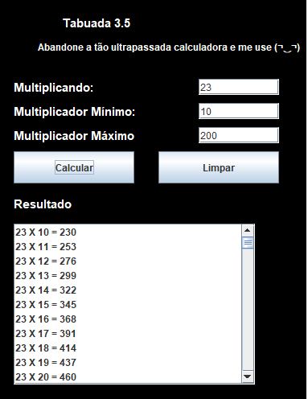

# **TABUADA 1.0**

## **SOBRE**
- Aplicação tipo Tabuada criada com o intuito de criar uma JLIST com base no mínimo e máximo multiplicando.
    
- Foi proposto esse projeto pelo professor Fundamentos de Programação Orientada a Objetos com a finalidade de aplicarmos os conceitos aprendidos em aula na instituição [SENAI](https://jandira.sp.senai.br/).

## **TECNOLOGIAS APLICADAS**
- JAVA

## **FERRAMENTAS**
- ECLIPSE (IDE)
- GITHUB / GIT

## **CONCEITOS APLICADOS**
- GUI (Graphical User Interface)
- MODEL
- WHILE
- JLIST, JLABEL, JTEXT
- POP-UP DE ERROS (JOPTION PANE)

## **AUTOR**
- [Cleiton Cruz](https://github.com/cotilen)
